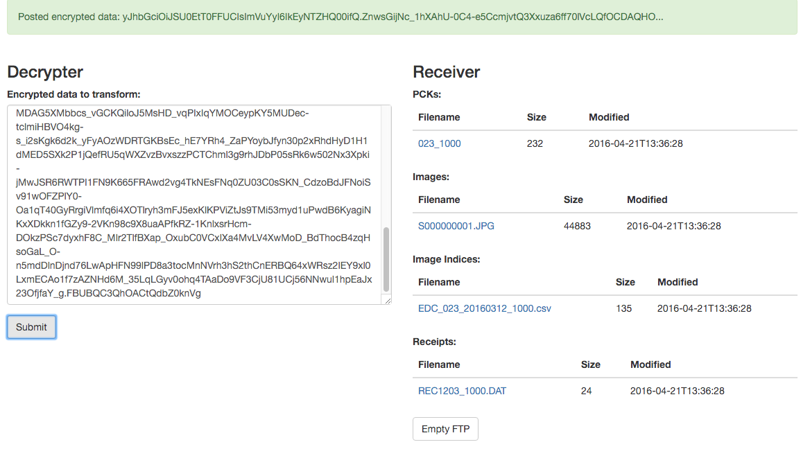
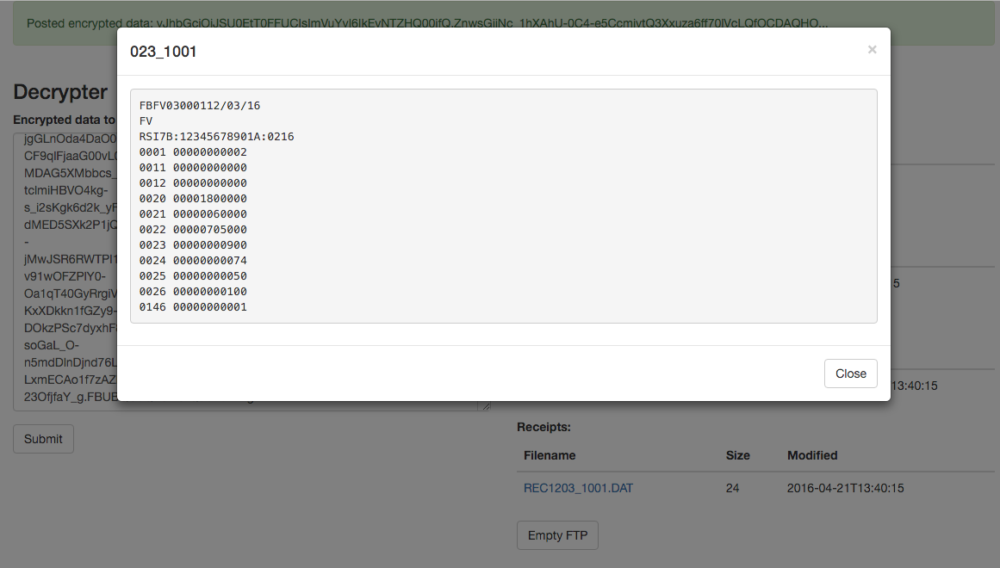

# sde-recover

The sde-recover app is used within the Office National of Statistics (ONS) for manual recovery of Survey Data Exchange (SDE) Payloads.

## Installation

In order to recover payloads that have encountered errors, make sure you have docker and docker-compose installed and follow the steps below:

1. Check out the [dockers](https://github.com/ONSdigital/dockers) repo.
2. Check out [Perkin](https://github.com/ONSdigital/perkin), [Posie](https://github.com/ONSdigital/posie) and [sde-console](https://github.com/ONSdigital/sde-console) within the dockers folder created.
3. Make sure you have a folder containing each of the required keys under the 'jwt-test-keys' folder.

## Usage

To start the sde-console using the following command once all subcomponents have been cloned:

	docker-compose -f docker-compose-recover.yml up

The sde-console will be started and exposed via docker on port 80, visit the ip address of docker in your browser. 

The app exposes a single endpoint at '/' to decrypt payloads that are already encrypted and transform them to downstream formats. This is useful for manually recovering data that has failed the transformation process for some reason, so long as it is properly encrypted JSON data and uses the same keys. 

Payloads are logged from the SDE application on error - retrieve the desired payload from the logs and paste into the decrypter.

The encrypted payload is entered on the left and downstream formats appear on the right within ftp.

If the payload isn't properly encrypted the sde-console will throw an error on submission.

### FTP Receiver

On both endpoints, the ftp receiver allows inspection of contents of all current files held within ftp. It is also possible to clear your ftp instance of all current files by using the "Empty FTP" button.